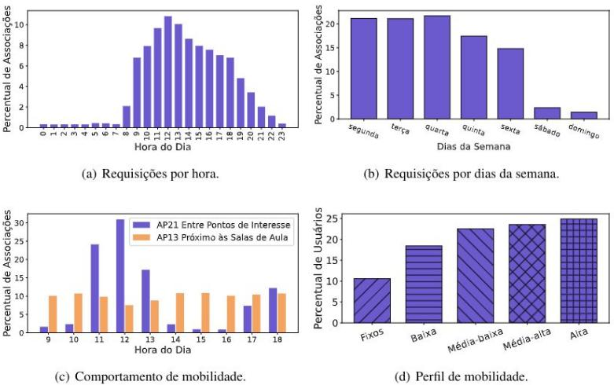
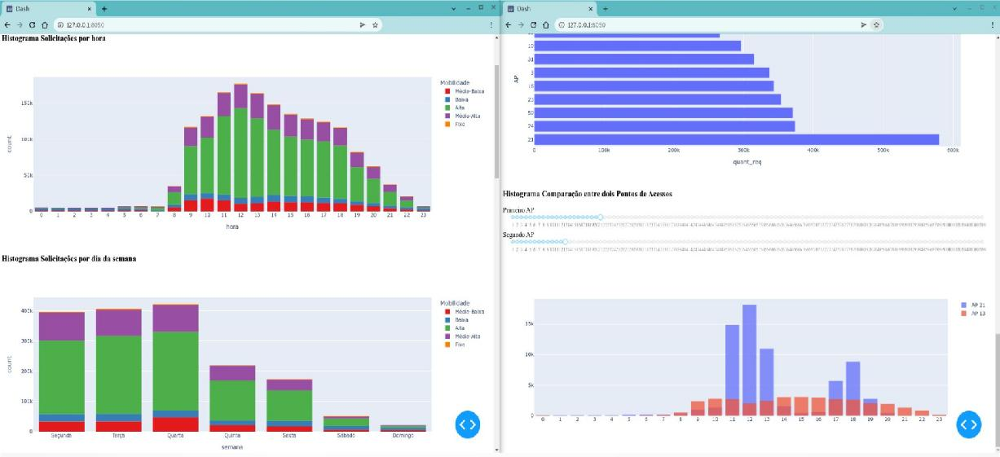

# Trabalho Prático INF 723
Departamento de Informática - Universidade Federal de Viçosa
Visualização de Dados 2022/01 - INF 723
Profa. Sabrina de Azevedo Silveira
Discente Airton Ribeiro Filho

## Trabalho Prático
**Desenvolver um projeto relacionado ao seu trabalho de pós-graduação. Este projeto deve realizar uma proposta de representação visual interativa aplicada ao trabalho de mestrado/doutorado.**

- [Base de Dados](#base-de-dados)
- [Caracterização Anterior](#caracteriza--o-anterior)
- [Base de Dados Reprocessada](#base-de-dados-reprocessada)
- [Objetivos da Visualização](#objetivos-da-visualiza--o)
- [Ferramentas](#ferramentas)
- [Opções da Visualização](#op--es-da-visualiza--o)
- [Estratégias Utilizadas](#estrat-gias-utilizadas)
- [Contatos:](#contatos-)

<small><i><a href='http://ecotrust-canada.github.io/markdown-toc/'>Table of contents generated with markdown-toc</a></i></small>

## Base de Dados
- 4 meses de logs de autorizações da rede sem fio
- 14,2m requisições
- dispositivos (36k dispositivos) - sem localização exata
- ponto de acesso (108 aps)
- timestamp
- método de autenticação utilizado (dado extremamente incompleto)

## Caracterização Anterior
A caracterização anterior, em visualização clássica e sem interatividade.

## Base de Dados Reprocessada

Base de dados processada com dados estatísticos simples, porém para
otimizar a inicialização dos datasets.

Novas bases:
- df_client
- df_ap

## Objetivos da Visualização
Apresentar o dataset de forma interativa para atrair maiores usuários interessados. Áreas de interesses:
- redes
- gestão de identidades
- mobilidade

Mostrar as características do dataset com informação sobre demanda, análise de um grupo específico de dados, ajustes dinâmicos, ampliação e redução da visualização, seleção com sliders e menus flutuantes.

**Contribuição Principal:**
Dataset será disponibilizado para a comunidade acadêmica, e a apresentação da base de dados de forma interativa poderá trazer maiores interessados.

## Ferramentas
Python 3.9.2
- Plotly 5.8.0
- Dash 2.4.1 / Flask 2.1.2
- NumPy 1.22.4
- Pandas 1.4.2

## Opções da Visualização
- Características da base de dados
- Escolha de Dispositivo para Comparação
- Seleção de Grupos (visível / ocultado)
- Seleção para Top Pontos de Acessos

## Estratégias Utilizadas
O dashboard foi construído para poder visualizar os dados que o compõem, para entender a semântica das características e para poder analisar melhor os dados. Foram utilizadas as seguintes técnicas: ampliação e redução, panning, datalhes sob demanda, remoção de variáveis, visualização ordenada, comparação com uso de filtros, redimensionamento de escala, e reprocessamento da base de dados para realizar uma re-expressão.

Todos os gráficos podem ser ampliados e reduzidos selecionando com o mouse, ou clicando duas vezes na visualização. A seleção para zoom pode ser em uma direção horizontal, uma direção vertical, em regiões retangulares ou circulares.
O panning,  deslizar a imagem, está disponível em todas as visualizações, portante pode-se fazer isso clicando e arrastando os eixos x e y.
Todas as visualizações permitem explorar detalhes sob demanda, apresentando valores mais detalhados ao posicionar o mouse sobre os dados da visualização.

Em alguns gráficos pode-se adicionar e remover variáveis de forma dinâmica selecionando os objetos diretamente na legenda.

Temos o uso de uma visualização de forma ordenada para facilitar a comparação dos valores da característica analisada.

Em uma das visualizações é possível realizar a comparação de uma determinada característica com entradas diferentes de forma dinâmica. Nessa visualização é utilizado o filtro de seleção das entradas com slider.

Tem-se uma visualização que permite selecionar, de forma dinâmica, características para serem analisadas, e tem a opção de redimensionamento ao ajustar o eixo y em escala logarítmica ou decimal.

A base de dados foi reprocessada para facilitar a exibição de alguns dados estatísticos e essa re-expressão traz novos dados ao mesmo dataset, porém de uma forma mais simples.

## Contatos:
Airton Ribeiro Filho

airton.r.filho@ufv.br
